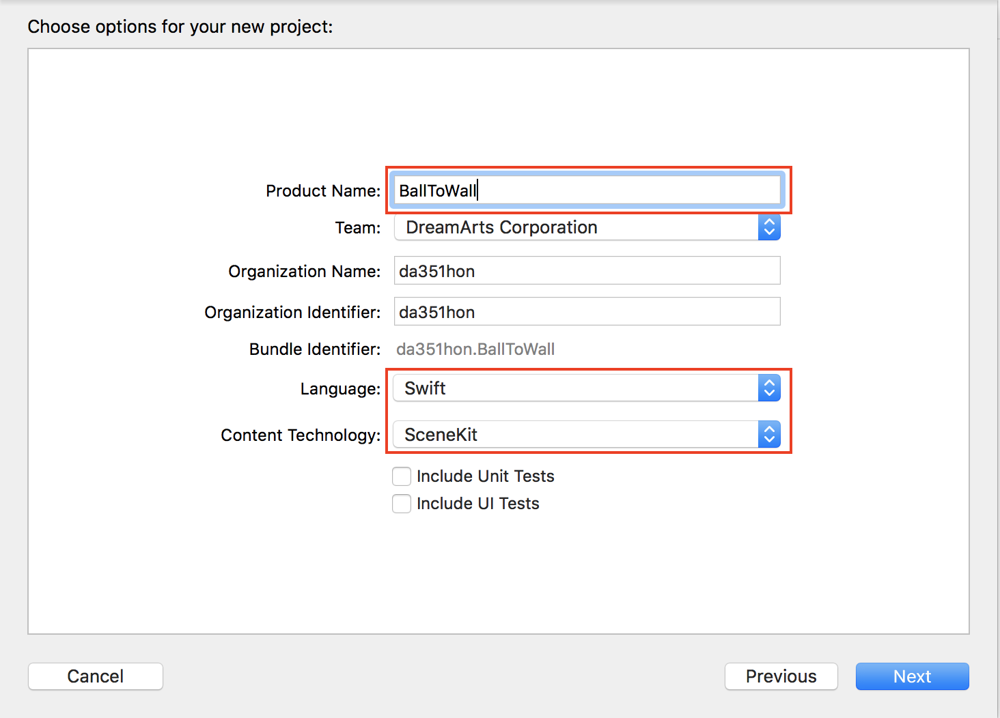

## BallToWall
### 概要
垂直面を認識し、タップした位置から物理演算を行って球を投げるデモ。
### 作成手順  

1. Xcodeで新規プロジェクトを作成し、「Augmented Reality App」を選択する。  
   

2. 任意のプロジェクト名（ここでは「BallToWall」とする）、Languageは「Swift」、Content Technologyは「SceneKit」を選択する。  
※ SceneKit：簡単に3Dゲームを作ることができるフレームワーク  
  

3. 飛行機を削除し、垂直面認識指定を行う処理を追加する。  
[変更内容](https://github.com/KantaiMishima/20190222_ARKit/commit/4588e411e7c850db14bfd8512660c0884f49c0eb#diff-be3707e1953e6d563e6f7989ba21dab7)

4. 垂直面検出時に平面を配置、更新する処理を追加する。  
[変更内容](https://github.com/KantaiMishima/20190222_ARKit/commit/57a9f9faeba08b9e20866c975582ca163511a32d#diff-be3707e1953e6d563e6f7989ba21dab7)

5. 実行すると以下のスクリーンショットのように表示される。垂直面を認識している場所に平面が配置される。  
  

6. タップした位置に球を配置する処理を追加する。  
[変更内容](https://github.com/KantaiMishima/20190222_ARKit/commit/98a1899be841792db308bc8be26a35081492c159#diff-be3707e1953e6d563e6f7989ba21dab7)

7. 球に対して物理演算処理を追加する。  
[変更内容](https://github.com/KantaiMishima/20190222_ARKit/commit/d1be5b5d12577daf3a059605d804464524ffc345#diff-be3707e1953e6d563e6f7989ba21dab7)

8. 平面に対する物理演算を追加する。  
[変更内容](https://github.com/KantaiMishima/20190222_ARKit/commit/ce435791dc71033378f66c13410156177b794345#diff-be3707e1953e6d563e6f7989ba21dab7)

9. XCode上でビルドし実行する。
垂直面検出後に画面をタップすると、ボールが跳ね返る様子が確認できる。
 

### [今回のソースコード](https://raw.githubusercontent.com/KantaiMishima/20190222_ARKit/master/BallToWall/BallToWall/ViewController.swift)
